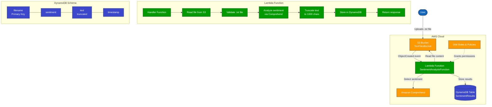

```mermaid
flowchart TD
    User([User]) -->|Uploads .txt file| S3[S3 Bucket\nTextFilesBucket]
    
    subgraph AWS Cloud
        S3 -->|ObjectCreated event| Lambda[Lambda Function\nSentimentAnalysisFunction]
        
        Lambda -->|Read file content| S3
        Lambda -->|Detect sentiment| Comprehend[Amazon Comprehend]
        Lambda -->|Store results| DynamoDB[(DynamoDB Table\nSentimentResults)]
        
        IAM[IAM Roles & Policies] -.->|Grants permissions| Lambda
    end
    
    subgraph Lambda Function
        Handler[Handler Function] --> ReadS3[Read file from S3]
        ReadS3 --> ValidateFile[Validate .txt file]
        ValidateFile --> AnalyzeSentiment[Analyze sentiment\nvia Comprehend]
        AnalyzeSentiment --> TruncateText[Truncate text\nto 1000 chars]
        TruncateText --> StoreDynamoDB[Store in DynamoDB]
        StoreDynamoDB --> ReturnResponse[Return response]
    end
    
    subgraph DynamoDB Schema
        PK[filename\nPrimary Key] --- Sentiment[sentiment]
        Sentiment --- TextContent[text\ntruncated]
        TextContent --- Timestamp[timestamp]
    end
    
    classDef aws fill:#FF9900,stroke:#232F3E,color:white;
    classDef lambda fill:#009900,stroke:#232F3E,color:white;
    classDef database fill:#3B48CC,stroke:#232F3E,color:white;
    classDef process fill:#1166BB,stroke:#232F3E,color:white;
    
    class S3,Comprehend,IAM aws;
    class Lambda,Handler,ReadS3,ValidateFile,AnalyzeSentiment,TruncateText,StoreDynamoDB,ReturnResponse lambda;
    class DynamoDB,PK,Sentiment,TextContent,Timestamp database;
    class User process;
```